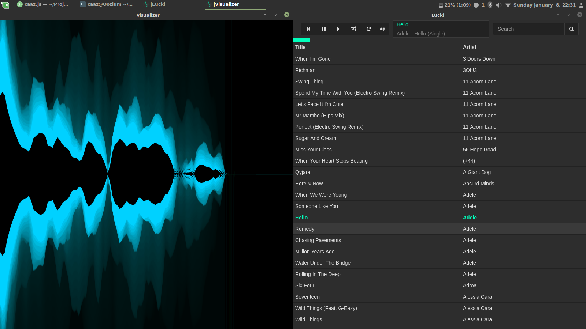

#  Lucki Media Player

> A music player by developers for developers.

Lucki Media Player is a simple media player. It makes no attempts to be the best, only the most flexible.

## Development
Everyone is encouraged to work on this project, if you have the time and interest feel free to make some changes.

### Here are *some* ways you can help us out.
- The `main` branch is essentially our pre-release versions.
  - [Report](https://github.com/Caaz/lucki/issues) any bugs or issues you may have discovered on it
- Suggest new features for our [to-do list](TODO.md)
  - Do check if they already exist
- By writing code
  - No patch is too small, be it fixing typos or adding comments

### How to begin
- Fork this repository
- Clone your repository
- Run `git checkout development` to switch to the development branch
- Run `npm install` to install dependencies
- Make some changes
- Run `npm start` to run your changes
- Run `npm test` to validate your code passes xo tests.
- Submit your pull request

### Bundling for other systems
The package electron-packager handles the heavy lifting of exporting for other systems, to use it, Run `npm run build`

## Collaborators
- Daniel Caaz
- Gentry Rolofson  
- Michael Bartlett  

## Known bugs

  - Previous Track doesn't actually go to your previous track
  - Shuffle is actually random

## To-do

- *Library*
  - [ ] Watch library folder for changes
  - [ ] Add to library via drop-in
  - [ ] More than one library directory
  - [ ] flac, m4a, wav, midi, ogg support
- *Controls*
  - [ ] Previous/Next track also function as rewind and fast-forward
  - [ ] Repeat Playlist/One toggle
  - [ ] Shuffle/Random toggle
  - [ ] Stop control
  - [ ] Letter input will scroll to first entry beginning with that letter of the sort
    - *i.e. sorted by artist, hit "r", taken to first artist that begins with "r"
- *Library browser*
  - [ ] Add a context menu
    - [ ] Show file properties
    - [ ] Ability to edit tags
    - [ ] Delete file
      - [ ] *(obscure)* Keyboard shortcut to also do this quickly
    - [ ] Show in file explorer
  - [x] Toggle table columns
  - [ ] Remove leading zeros from track #
  - [ ] Track duration and current time in now playing
  - [ ] Track duration as a column
  - [ ] File size of track as a column
  - [x] Clicking track info section at top of player scrolls to the track in current list/library
- *Playlist*
  - [ ] Dynamic playlists
    - [ ] Recently Added
    - [ ] Most played
    - [ ] Suggested from now playing
  - [ ] Custom playlists
    - [ ] Drag tracks into playlist
  - [ ] Favorites and Favorites playlist. Perhaps a heart icon next to song title?
- *Desktop Integration*
  - [ ] Set Lucki as preferred default application to open media files
  - [ ] Show notifications properly on OSX, right now it has two icons
  - [ ] Show album art in notifications
- *Sort changes*
  - [ ] When sorting by artist, group by album.
    - [ ] Show album art in a column with this view
  - [ ] When sorting by artist, ignore 'The '
  - [ ] When sorting by album, group by artist.
  - [ ] Group everything else by letter
- *Visualizer*
  - [x] Modulate each visualizer to separate files
  - [ ] Per-visual settings (context menu)
  - [ ] Read in colors from user theme
- *Misc*
  - [ ] Add an Equalizer
  - [ ] Save window dimensions
  - [ ] Ability to choose a different theme
    - [ ] Let themes have their own icon.
  - [ ] Local webserver for remote control

### Misc
We couldn't have made this possible without those who created Electron, NodeJS, and those who handle ID3 libraries so credit to those creators as well.

## License
MIT © [Daniel Caaz](https://caaz.me)
